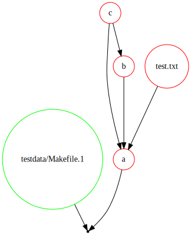
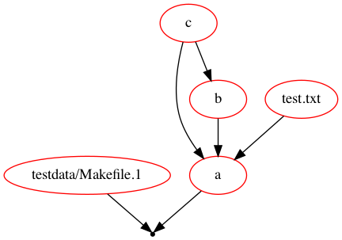

A spiritual successor to [makefile2graph](https://github.com/lindenb/makefile2graph/) rewritten in go with added functionality.

Generate visualizations of makefile DAGs:

Graphviz to svg:

`make -f testdata/Makefile.1 -Bnd | ./makesense --type gv > assets/output.svg`

Dot:

`make -f testdata/Makefile.1 -Bnd | ./makesense --type dot | dot -Tpng -o assets/output.png`

