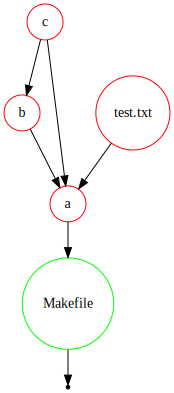
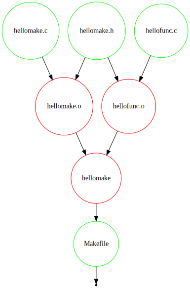
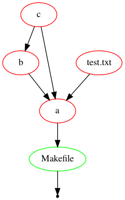
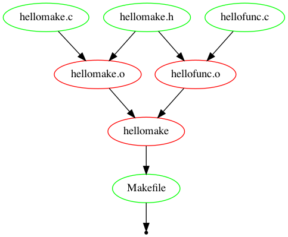
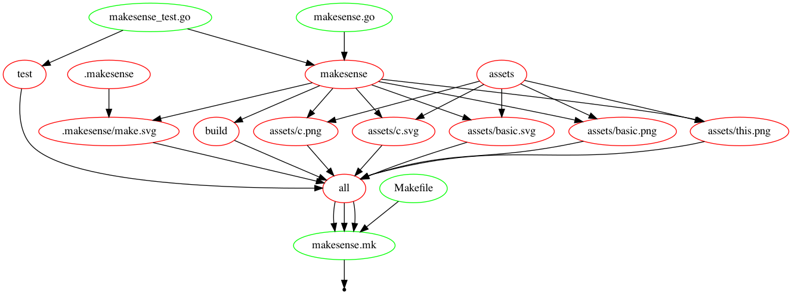

A spiritual successor to [makefile2graph](https://github.com/lindenb/makefile2graph/) rewritten in go with added functionality.

Generate visualizations of makefile DAGs:

Graphviz to svg:

`make -C testdata/basic -Bnd | ./makesense --type gv > assets/basic.svg`

`make -C testdata/c -Bnd | ./makesense --type gv > assets/c.svg`

This project's makefile:

Dot:

`make -C testdata/basic -Bnd | ./makesense --type dot | dot -Tpng -o assets/basic.png`

`make -C testdata/c -Bnd | ./makesense --type dot | dot -Tpng -o assets/c.png`

This project's makefile:

